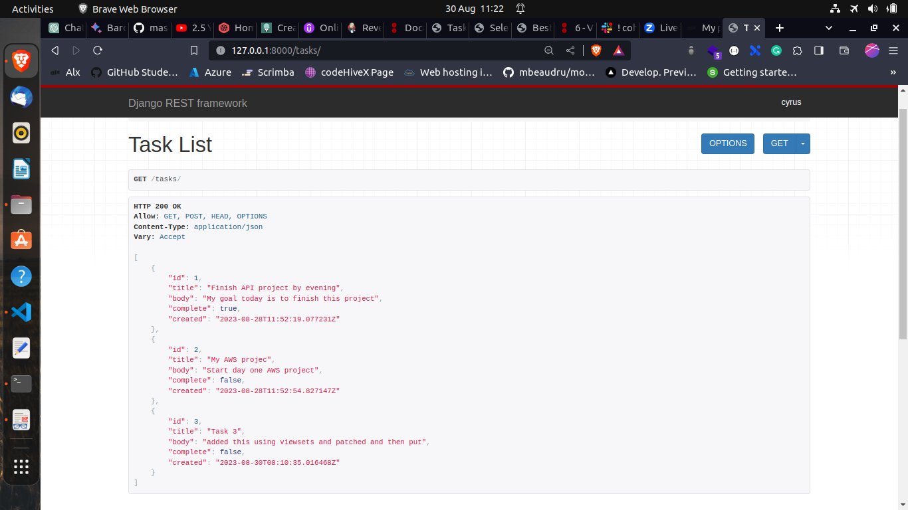

# Django_REST_API
This is a simple Django project to help me work and learn Django Rest framework

## Installation
```bash
git clone https://github.com/CyrusNchege/Django_REST_API.git
```
```
cd Django_REST_API
```
### Create a virtual environment  and acticate environment
#### linux
```
 python3 -m venv env

source env/bin/activate
```
#### windows
```
 python -m venv env

.\env\Scripts\activate

```
### Install requirements
```
pip install -r requirements.txt
```
make migrations
```
python manage.py makemigrations
python manage.py migrate
```

# Streamlined API Development with Viewsets and Routers in Django REST Framework

In Django REST Framework, Viewsets and Routers are powerful tools that expedite the process of developing APIs. They serve as an additional layer of abstraction built upon views and URLs. The primary advantage lies in the ability of a single viewset to replace multiple interconnected views. Furthermore, routers can automate the generation of URLs, relieving developers of this manual task.

## Key Benefits

- **Efficiency:** A single viewset can consolidate the functionality of several related views.
- **URL Generation:** Routers can automatically generate URLs, saving developers from manual URL configuration.
- **Reduced Code:** Particularly beneficial in extensive projects with numerous endpoints, as it minimizes the amount of code that needs to be written.
- **Enhanced Comprehension:** Experienced developers may find it easier to understand and reason about a small set of viewset and router combinations, compared to a lengthy list of individual views and URLs.

## Implementation

Viewsets and routers provide a simplified approach to API development. By leveraging these features, developers can focus on the core logic of their APIs rather than dealing with repetitive tasks. This makes code maintenance and collaboration more efficient.

### Example Usage

```python
# Import required modules
# Define a Viewset (tasks/views.py)
from rest_framework import viewsets
from .models import Task
from .serializer import TaskSerializer

# Create your views here.

class TaskViewSet(viewsets.ModelViewSet):
    queryset = Task.objects.all().order_by('created')
    serializer_class = TaskSerializer

# Create a Router(tasks/urls.py)
from rest_framework import routers
from . import views

router = routers.DefaultRouter()
router.register('', views.TaskViewSet)

urlpatterns = router.urls
```

### Endpoints
```
/tasks/
```
[](images/gettasks.png)


